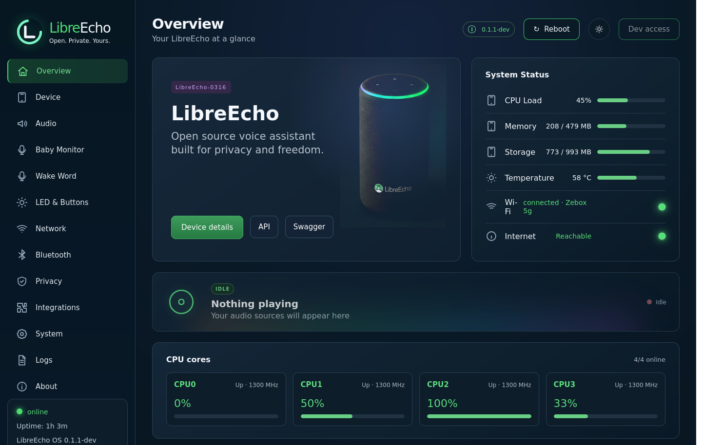
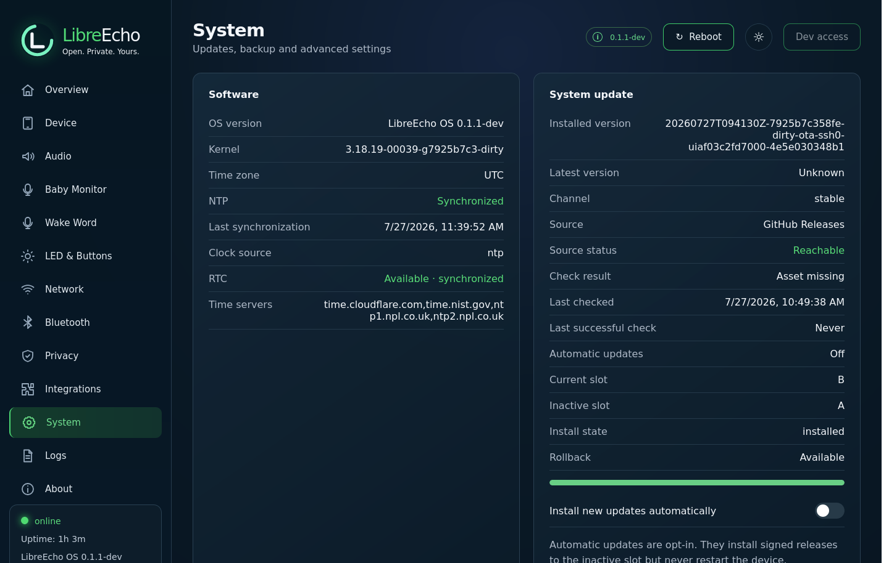

# LibreEcho

### A repairable, private voice assistant for hardware you already own.

[Visit libreecho.org](https://libreecho.org/) | [Download the latest OTA](https://github.com/aslater3/LibreEcho/releases/latest) | [Support the project](https://buymeacoffee.com/libreecho)

<table>
<tr>
<td></td>
<td></td>
</tr>
</table>

> These are captures of the running LibreEcho Control Centre on the development
> device. The interface, API, and test suite live in [LibreEcho-UI](https://github.com/aslater3/LibreEcho-UI).

LibreEcho is an open embedded voice-assistant operating system focused on
privacy, repairability, and local control. It turns an Echo 2nd Gen-class
device into a locally managed system with a signed A/B update path, visible
system health, and a web control centre that stays on your network.

## Start Here

- **Website:** [libreecho.org](https://libreecho.org/)
- **Latest release:** [signed OTA bundles](https://github.com/aslater3/LibreEcho/releases/latest)
- **Control centre:** [LibreEcho-UI](https://github.com/aslater3/LibreEcho-UI)
- **Hardware and OS:** [LibreEcho-Kernel](https://github.com/aslater3/LibreEcho-Kernel)
- **Issues:** [report a reproducible product problem](https://github.com/aslater3/LibreEcho/issues/new/choose)
- **Support:** [buy me a coffee](https://buymeacoffee.com/libreecho)

## What Is Included

- Local web administration for device, audio, wake word, networking, logs, and system settings.
- Signed A/B OTA updates with opt-in automatic installation and a manual update action.
- Linux kernel and initramfs bring-up for the MT8163 ARM32 platform.
- Clear component boundaries so UI work, hardware work, and product support can evolve independently.

## Repositories

| Repository | Owns |
| --- | --- |
| [`LibreEcho`](https://github.com/aslater3/LibreEcho) | Product site, documentation, support, roadmap, issues, release notes, and OTA distribution |
| [`LibreEcho-Kernel`](https://github.com/aslater3/LibreEcho-Kernel) | MT8163 kernel, initramfs, hardware bring-up, image construction, OTA verification, and release workflow |
| [`LibreEcho-UI`](https://github.com/aslater3/LibreEcho-UI) | Web control centre, HTTP API, service daemons, and UI tests |

See [the repository boundary guide](docs/repositories.md) for where a change belongs.

## Support

Use the issue tracker for reproducible bugs and hardware problems. Include the
device model, OS version, active slot, relevant logs, and the smallest reliable
reproduction. Do not include Wi-Fi passwords, API tokens, or private keys.

Once Discussions are enabled in the repository settings, use them for design
questions, setup help, and ideas that are not yet actionable bugs.

## License

LibreEcho is released under the MIT License. Component repositories may carry
their own copies of the license and additional notices.
