# Echo Gen 2 Disassembly Guide

This guide explains how to disassemble the Echo Gen 2. Proceed slowly and carefully to avoid damaging the ribbon cable, speaker cable, or other components.

## Required tools

- T10 screwdriver
- T8 screwdriver
- Tweezers

## Disassembly

1. Use the T10 screwdriver to remove the four bolts securing the bottom plate.

	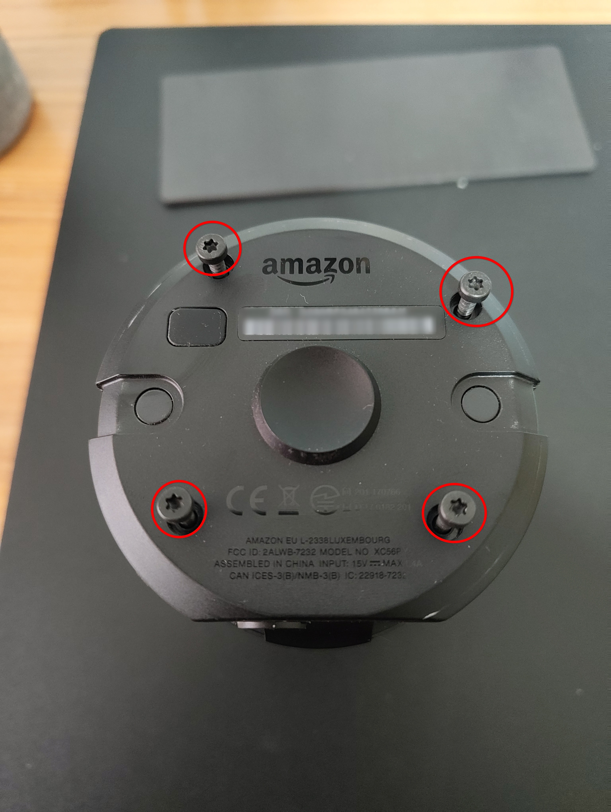

2. Using the same screwdriver, remove the two bolts securing the PCB. Use the tweezers to gently lift the white plate and release the ribbon cable.

	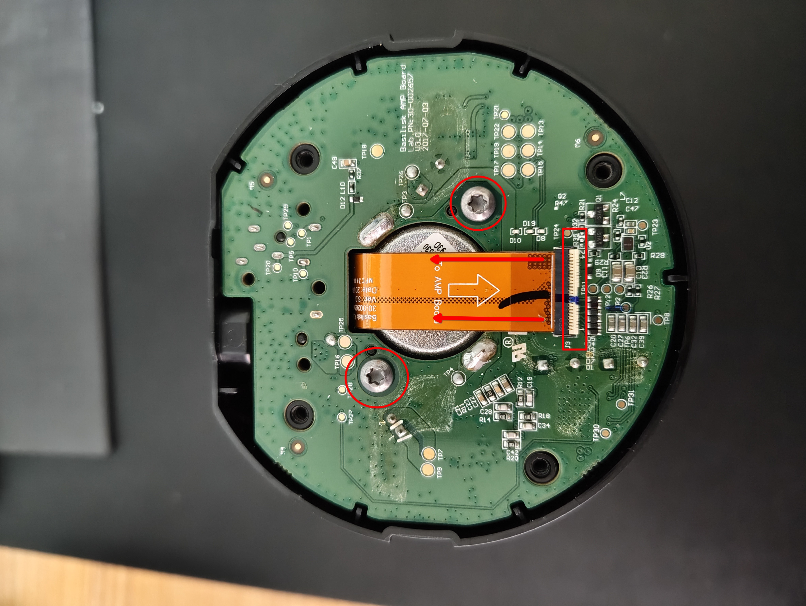

3. Turn the PCB over, then disconnect the speaker cable.

	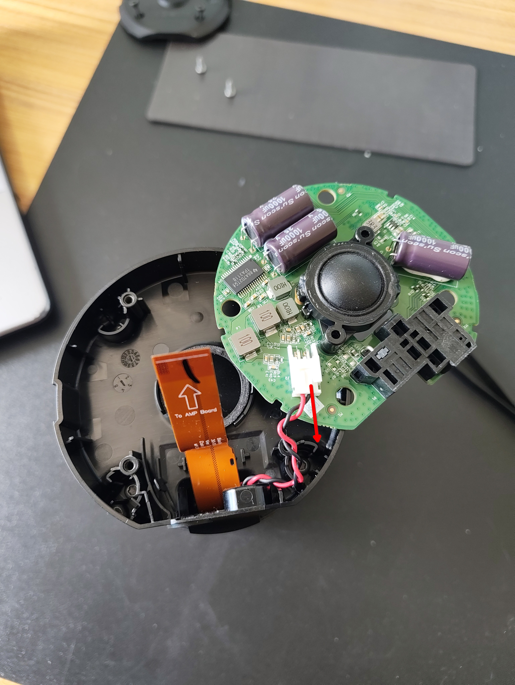

4. Remove the next four bolts to detach the black plate. Take care not to damage the ribbon cable or speaker cable.

	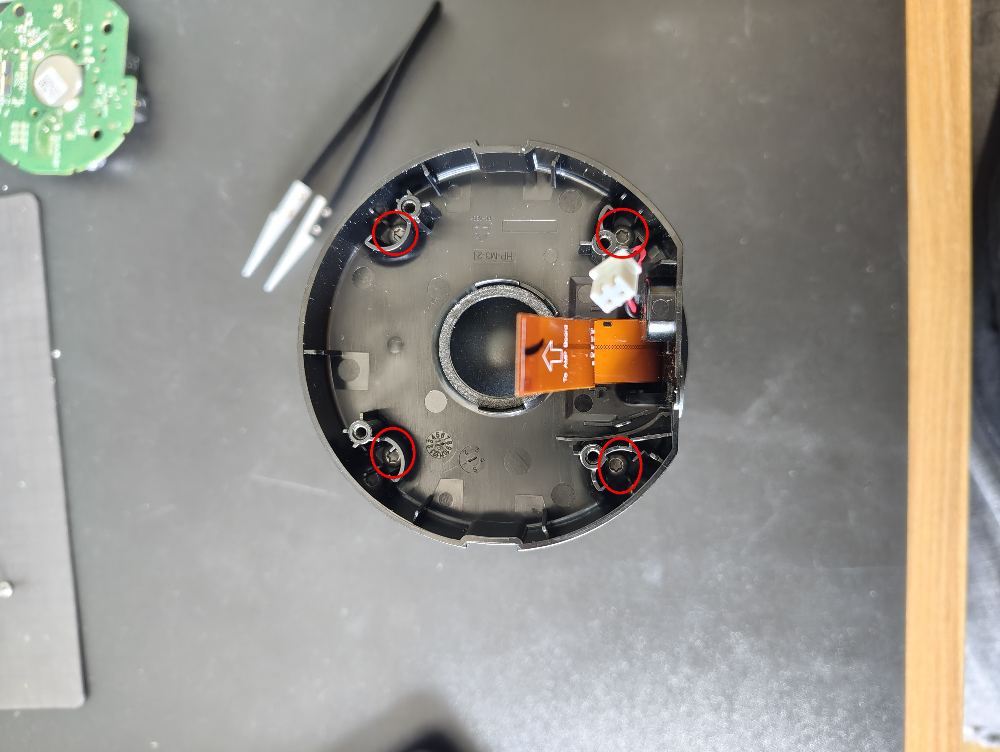
	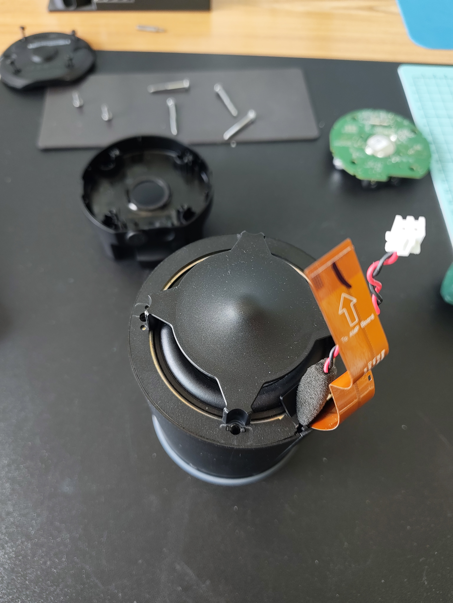

5. Carefully remove the black side plate to access the ribbon cable.

	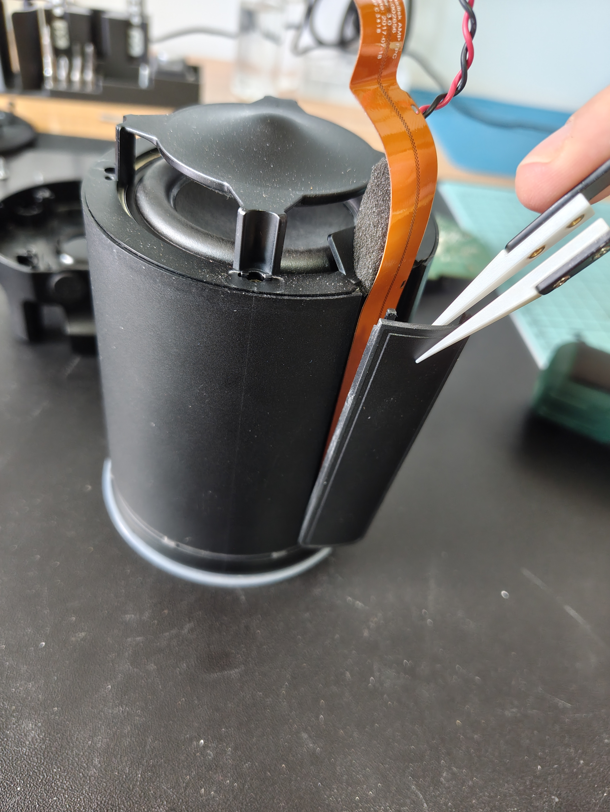

6. Use the tweezers, or another thin, flat tool, to apply gentle pressure and lift the speaker. The speaker is secured with adhesive, so proceed carefully to avoid damaging any components.

	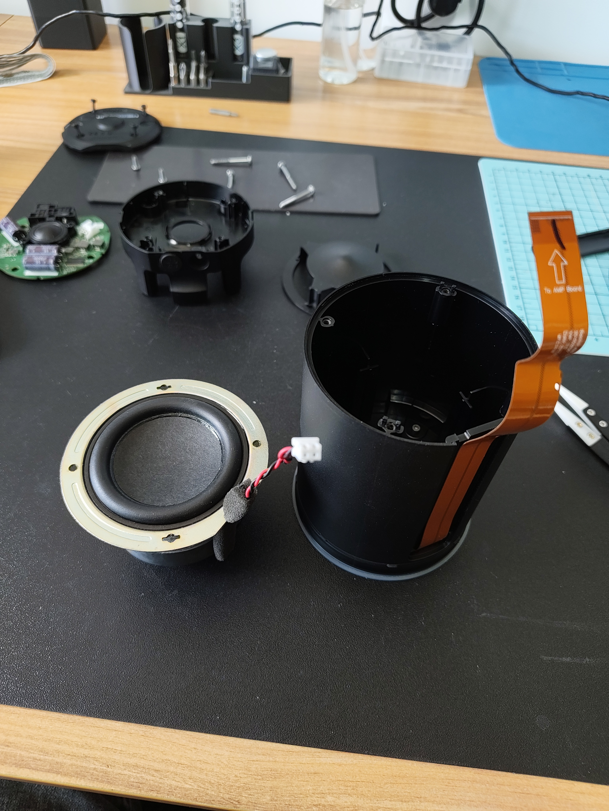

7. Use the T8 screwdriver to remove the four bolts securing the top plate.

	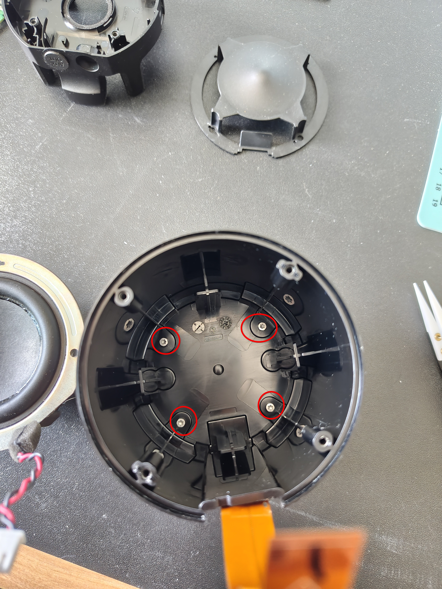

8. Carefully release the ribbon cable from the PCB. Lift the black locking plates before pulling the cable free.

	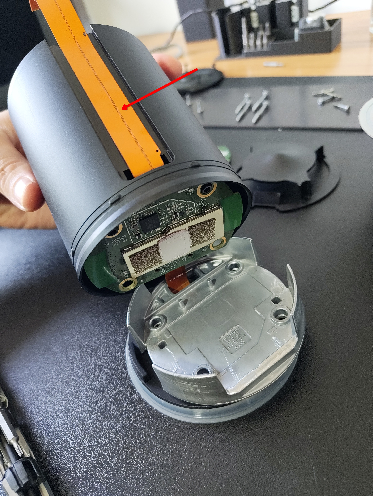
	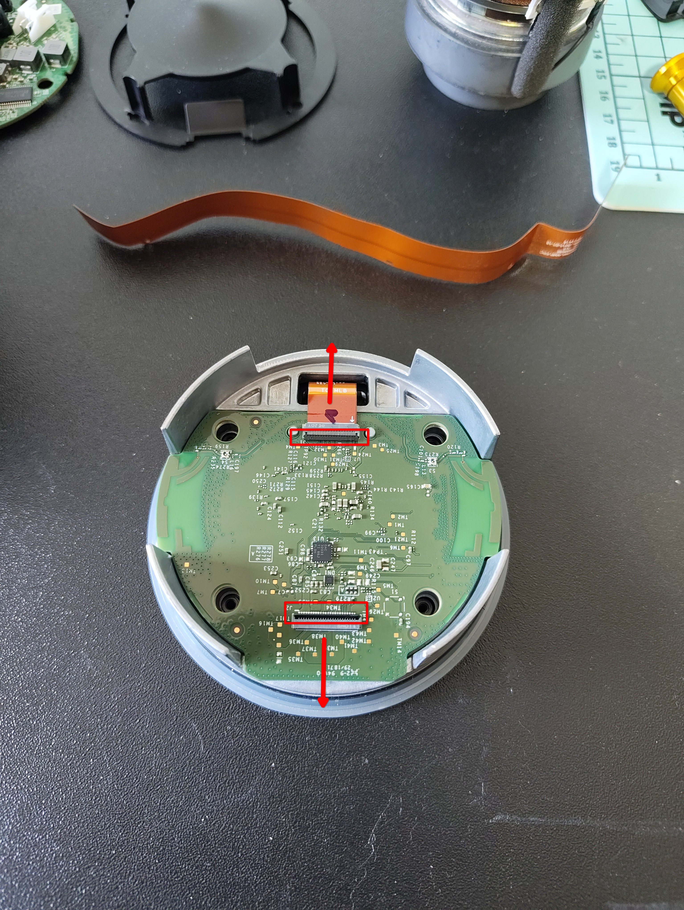

9. Use the tweezers, or another thin, flat tool, to apply gentle pressure and remove the metal shield.

	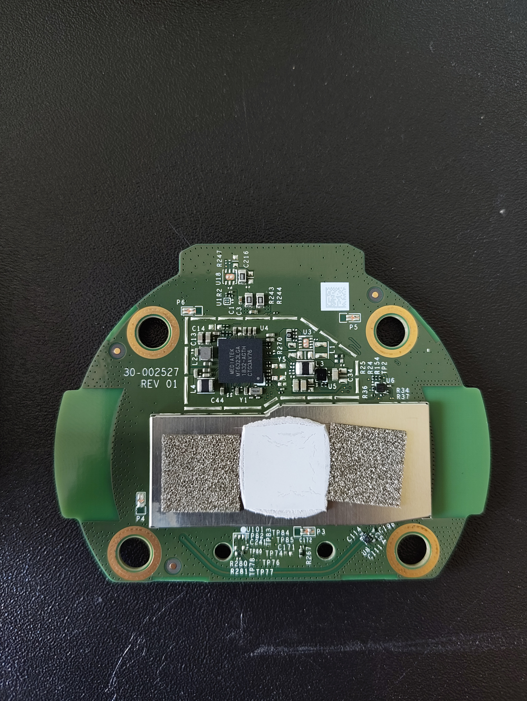
	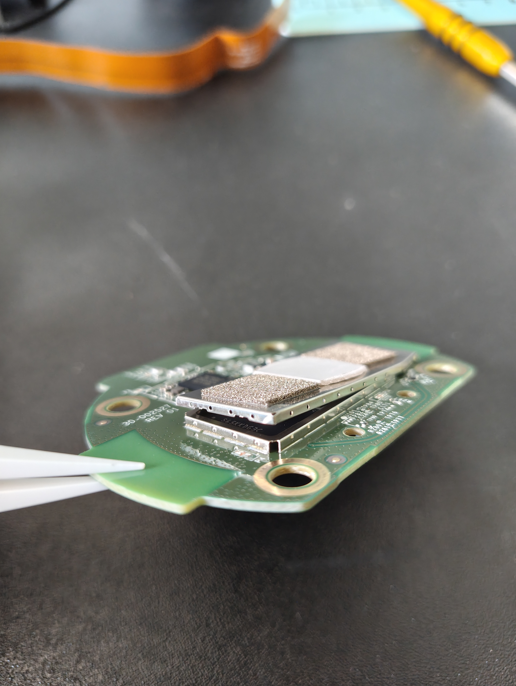

10. The resistor that must be shorted to GND should now be accessible. Solder the USB cable as described in the [installation guide](../../install/README.md).

	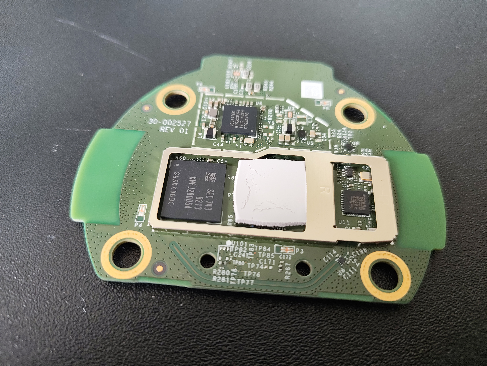
	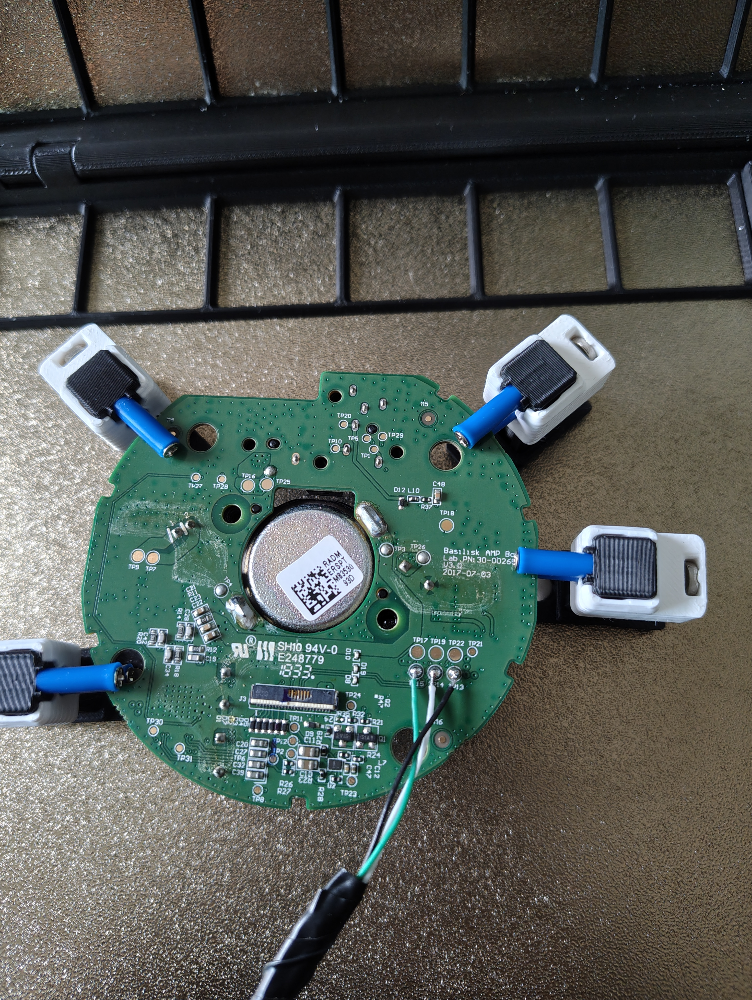