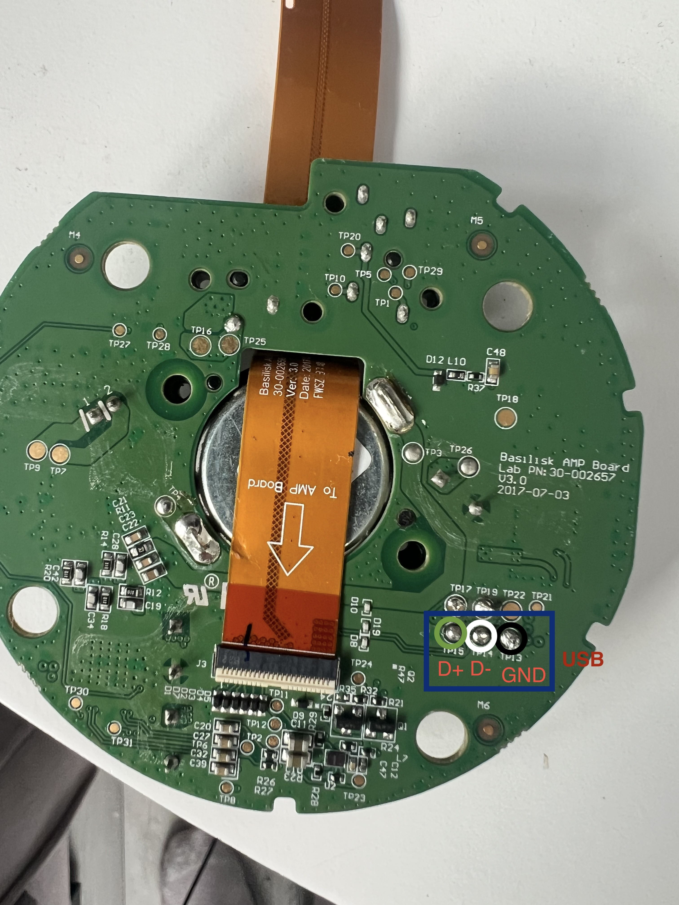
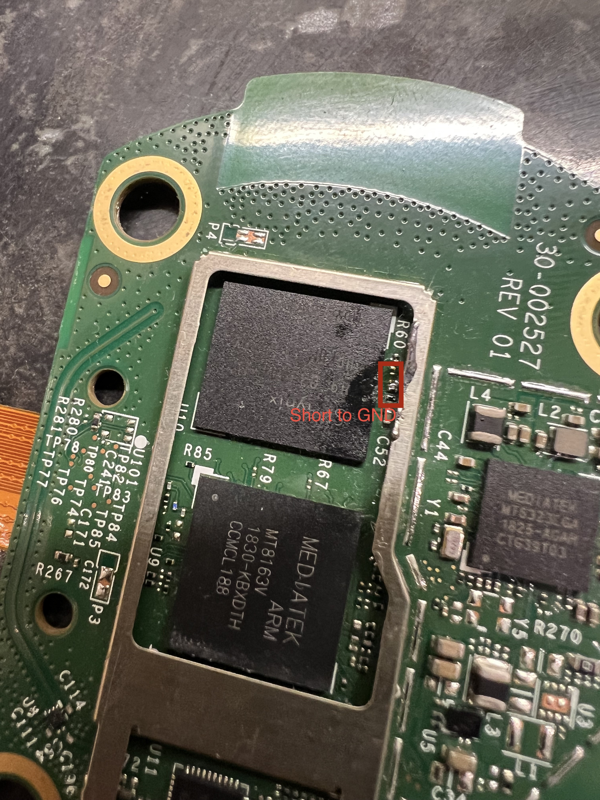
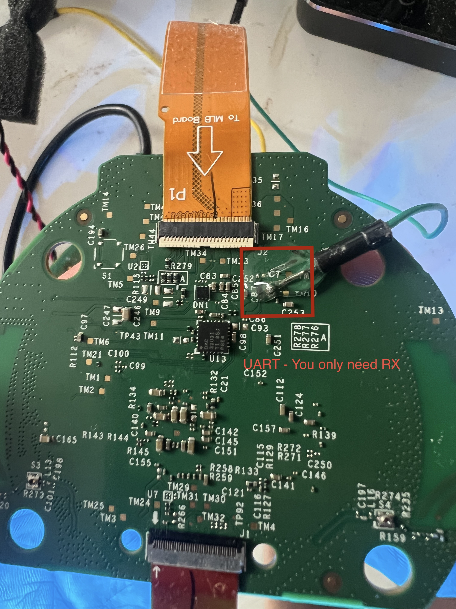

# LibreEcho installation guide

> For Amazon Echo 2nd generation (`radar_puffin`, MT8163). This procedure
> involves opening the device, soldering, exposed electronics, and entering
> MediaTek BROM mode.

## Safety first

- Unplug the Echo before opening it. Never solder or probe a powered board.
- The eMMC and BROM short point are underneath the heat spreader. Remove it
  carefully and protect the thermal pad.
- Use an insulated probe or purpose-built pogo jig for the short.
- Never short the UART point, USB `D+`/`D-`, a capacitor, inductor, crystal,
  battery contact, or another test pad.

## Equipment

### Required

- Data-capable USB cable
- `adb` and `fastboot` (Debian/Ubuntu packages: `adb` and `fastboot`)
- `bash`, `curl`, and Python 3
- `mke2fs` (from `e2fsprogs`) and `img2simg` (from
  `android-sdk-libsparse-utils`)

On Debian/Ubuntu, install the host tools before starting the installer:

```sh
sudo apt-get update
sudo apt-get install adb fastboot e2fsprogs android-sdk-libsparse-utils
```

The installer can offer to install only the filesystem-image helpers with
`--install-host-deps`; it does **not** install `adb` or `fastboot`. Confirm they
are available with `command -v adb fastboot mke2fs img2simg`.

- Fine-tip temperature-controlled soldering iron
- Fine solder, flux, 30–34 AWG wire, and Kapton tape
- Fine-point pogo pins and a stable pogo-pin jig, if not soldering
- Fine tweezers, plastic spudger, and small screwdrivers
- Magnification and good lighting
- ESD mat/wrist strap or static-safe work surface
- Digital multimeter with continuity mode
- Latest **initial-install bundle** and matching SHA-256 file
- Insulated probe or purpose-built pogo jig for the BROM short

### Optional: developer UART console

UART is **not required to install or flash LibreEcho**. USB is the required
connection for installation. Developers may add UART to watch boot messages or
debug hardware:

- 3.3 V USB-to-TTL serial adapter, adjustable to 921600 baud
- Fine-point pogo pins and a stable pogo-pin jig, or 30–34 AWG wire

Never connect a 5 V UART adapter. For the optional console, connect the board's
UART signal to the adapter's **RX input** and board ground to adapter GND. Leave
adapter TX and VCC disconnected.

## 1. Download and verify the release

LibreEcho stable releases use immutable tags in the form
`radar-puffin-vX.Y.Z`. Select the intended tag before beginning the BROM
sequence. The installer, checksum inventory, and release assets must all refer
to that exact immutable tag.

Download the matching wrapper from a **published stable** release. Do not use
an unpublished development candidate or prerelease as a public installation
instruction:

```sh
TAG=radar-puffin-vX.Y.Z  # replace with the published stable tag you selected
curl -fL -o run-one-shot.sh "https://github.com/aslater3/LibreEcho/releases/download/${TAG}/libreecho-${TAG}-run-one-shot.sh"
chmod +x run-one-shot.sh
```

For a development or nightly build, download its complete immutable wrapper asset
instead. Do not start the installer until the Echo and USB are prepared in
sections 2–4.

The wrapper verifies the installer checksum using public GitHub download URLs
and does not require a GitHub account or token. For a development or nightly
build, pass that build's complete immutable tag. Do not rename or mix asset
files from another release.

## 2. Open the Echo

1. Disconnect power and USB.
2. Photograph the enclosure, screws, and flex-cable routing.
3. Remove the cover with a plastic tool.
4. Remove the heat spreader to expose the eMMC and BROM short area. Keep the
   thermal pad clean and intact.
5. Photograph the heat-spreader position.
6. Release flex-cable latches before disconnecting cables; never pull on the
   orange flex cable.
7. Place the board on an insulating, static-safe surface.
8. Check that the board matches the photographs. Stop if it does not.

## 3. Connect USB

USB must be connected before attempting BROM or flashing. The USB connection is
made on the **amplifier/tweeter board** at the annotated `D+`, `D-`, and `GND`
pads. Connect these pads to a data-capable USB cable by soldering or with a
stable three-contact pogo-pin jig.



- **Soldering:** connect USB `D+`, `D-`, and `GND` to the matching wires in a
  data-capable USB cable.
- **Pogo pins:** use a jig that holds three separate contacts firmly on `D+`,
  `D-`, and `GND`. Check continuity and USB polarity before applying power.
- Do not connect these pads to a TTL UART adapter.

## 4. Enter BROM mode

The eMMC and BROM short point are underneath the heat spreader. The short is
made on the small resistor area connected to the eMMC data lines, at the marked
location in the photo. You are touching the marked resistors/eMMC data-line
contacts to the marked ground point—not a generic test pad.



1. Keep the board unpowered.
2. Use an insulated probe or purpose-built pogo jig.
3. Connect the data-capable USB cable, but do not power the Echo yet.
4. Start the installer now, after the Echo and USB are prepared:

   ```sh
   ./run-one-shot.sh "$TAG" --fastboot-serial auto --slots both --execute-hardware
   ```

   For a pinned development or nightly build, use its complete immutable tag
   only for maintainer-controlled test hardware—not the public installation
   flow.
5. When the installer/Amonet prompt appears, touch the marked
   resistor/eMMC data-line contacts to the marked ground point and apply power.
6. Release the short immediately when BROM appears or when Amonet prompts you.
7. Press Enter when Amonet prompts you.

Never leave the short in place while writing. Starting the installer before this
BROM sequence is required: it starts the Amonet listener and waits for the
transient BROM device.

## 5. Complete the installer transaction

The installer is already running from section 4. Follow its prompts without
restarting it or disconnecting USB. It validates the release, performs the
Amonet handoff, prepares userdata, writes both verified boot slots, reboots,
waits for ADB, verifies readback, stages the feature payloads, and creates the
temporary setup forward.

If BROM is not detected, remove power before repositioning the probe and repeat
the documented power/USB sequence. If installation fails, keep the installer's
log and exact error; do not retry with a different image or partition until the
failure is understood.

The `--slots both` option is intentional: it writes and verifies both boot
slots. Do not substitute a raw boot image, OTA archive, or manually selected
partition.
## 6. First boot and setup

1. The installer has already rebooted the Echo and waited for ADB. Do not touch
   the board or reconnect flex cables while it is powered.
2. Verify the temporary ADB connection and forward:

   ```sh
   adb wait-for-device
   adb get-state
   adb forward --list | grep 'tcp:18080'
   ```

3. Before Wi-Fi setup, open the installer's forwarded setup page:

   ```text
   http://127.0.0.1:18080/setup.html
   ```

   If the browser did not open automatically, enter that URL manually while
   the USB forward is active.
4. Complete the account and setup wizard. After Wi-Fi is applied, disconnect
   power before reconnecting any flex cables or closing the enclosure. Reconnect
   cables only while unpowered, then power on again.
5. On the normal LAN, open the advertised control-centre address:

   ```text
   http://libreecho.local:8080/
   ```

   If mDNS is unavailable, use the IP address assigned by your router:
   `http://<device-ip>:8080/`.
6. Verify that `libreecho.local` resolves and that the control centre remains
   reachable after reconnecting the computer to the normal LAN.
7. Test the features listed for the release.

The first-run setup creates the local administrator account and stores Wi-Fi
credentials on the device. The installer does not invent, print, or upload
those credentials. A factory reset later removes the account, setup marker,
Wi-Fi profiles, and other mutable configuration before rebooting back to this
first-run state.

## Optional developer UART

The UART point is on the **back of the CPU/SoC board, directly beneath `C7`**.
The annotated USB pads are on the **amplifier/tweeter board**.



To fit a temporary UART connection:

1. Make sure the board is completely unpowered.
2. Solder a fine wire to the UART point and a separate wire to ground, or use a
   stable pogo-pin jig.
3. Inspect for solder bridges and secure wires with Kapton tape.
4. Connect the UART signal to the adapter's RX input and ground to adapter GND.
5. Leave adapter TX and VCC disconnected.

Use **921600 baud, 8N1** if you want to read the console:

```sh
stty -F /dev/ttyUSB0 921600 cs8 -cstopb -parenb -ixon -ixoff -crtscts raw -echo
cat /dev/ttyUSB0
```

Replace `/dev/ttyUSB0` with the actual adapter device. UART is for observing and
debugging only; it is not part of the normal installation process.

## Troubleshooting

### BROM is not detected

- Remove power and the probe.
- Confirm the USB `D+`, `D-`, and `GND` connections.
- Confirm the short is on the marked resistor/eMMC data-line contacts and ground.
- Repeat the installation instructions' power/USB order.
- Try another USB cable or USB port without a hub.

### The payload loads, then the installer fails to read the eMMC

The clearest sign is that everything looks *right* until the very last moment:

```
Send payload
Let's rock
Wait for the payload to come online...
all good
Clear preloader header
eMMC read failed; lift the BROM short if it is still on, retrying
...
RuntimeError: read fail
```

**The short is still on.** `Clear preloader header` is printed immediately
before the installer's first read of the eMMC. The short works by preventing
the eMMC from being read, which is what stops the preloader starting and drops
the chip into BROM -- and it blocks the installer's own reads in exactly the
same way. So the exploit succeeds, the payload runs, and the first thing it
tries to do with the flash fails.

Nothing is wrong with the download, the USB connection, or the eMMC. No data
has been written at this point.

Fix it by removing the short as soon as the BROM device appears over USB
(step 4.6), before the installer gets this far. Then confirm it actually
lifted: solder residue, flux, or a wire resting against the pad still shorts
while looking clear. Check with a multimeter in continuity mode against the
marked ground point.

If the run stalls after `Clear preloader header`, you do not need to re-apply
the short to try again -- that step clears the preloader header specifically so
the board falls into BROM on its own. Re-shorting an already-cleared board is a
common way to end up back at this same error.

### BROM appears and disappears repeatedly

Cycles of `Waiting for bootrom` -> `Found port` -> `Handshake` that return to
`Waiting for bootrom` without ever reaching `Send payload`, or two `Found port`
lines in a row, mean the contact is making and breaking. That is an unstable
probe rather than a wrong location: a correct-but-intermittent short produces
this, and so does a probe that drifts as the board warms. Use a jig rather than
a handheld probe, and stop and re-seat rather than retrying dozens of times.

### Installer reports a write failure

Stop and note the error message. Do not try a different partition or image. Ask
for help with the release version, board revision, and error message.
