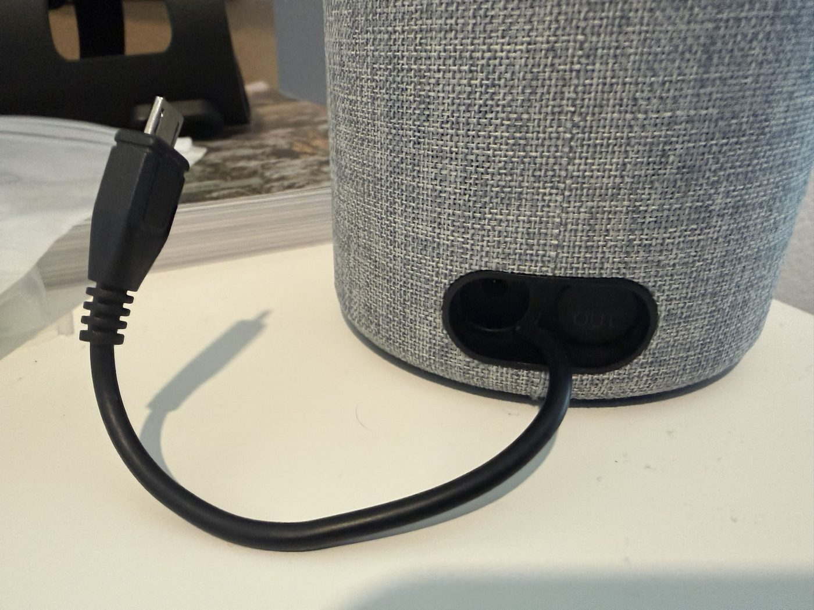
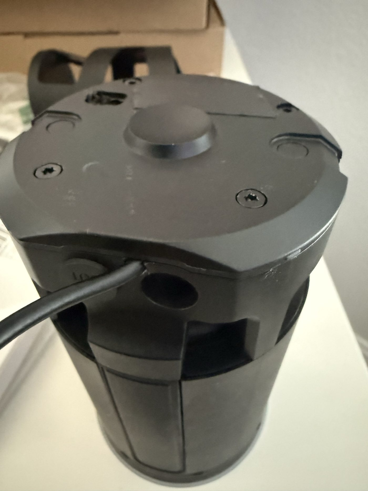
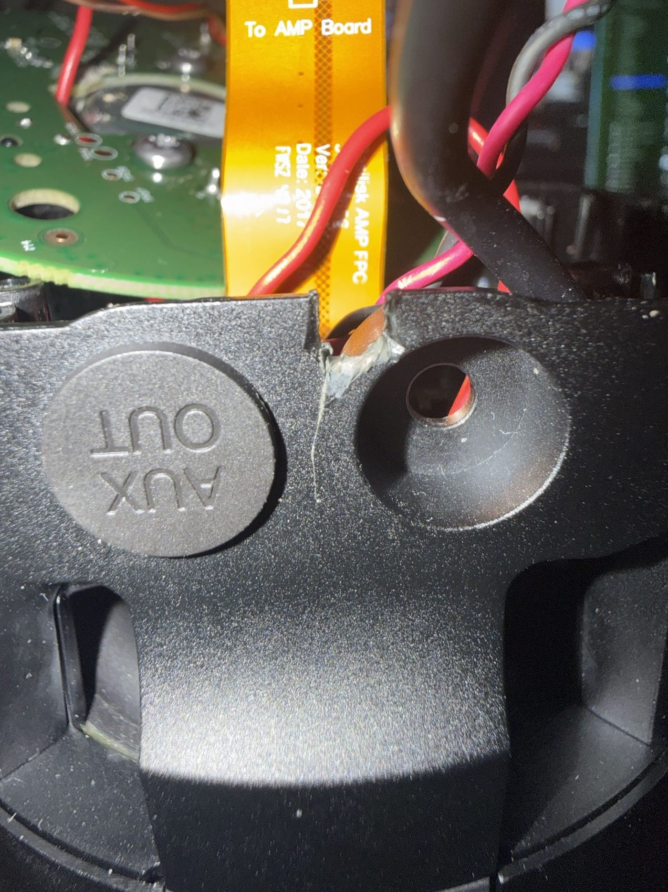
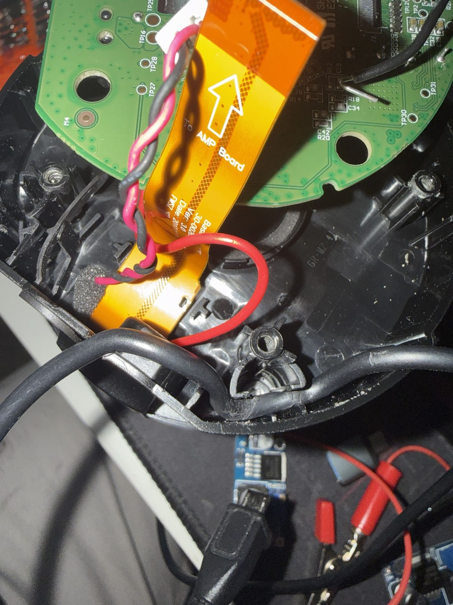
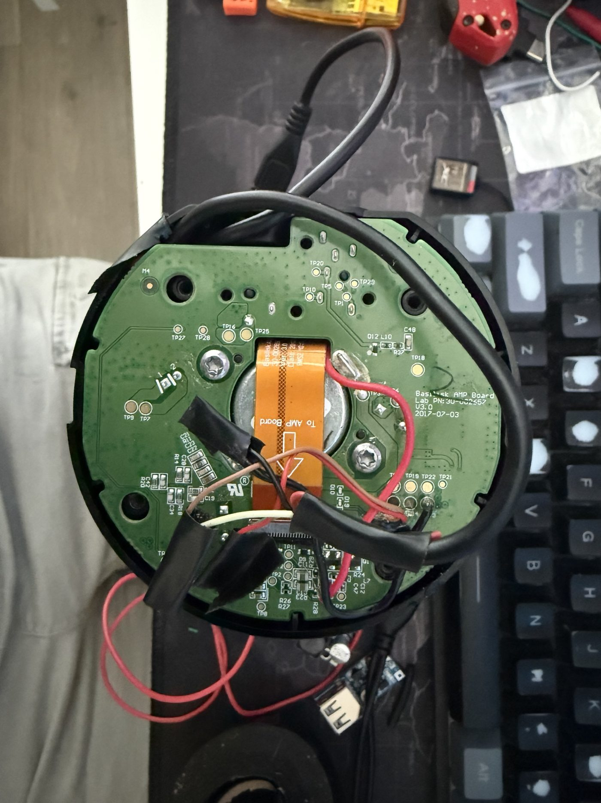

# Adding a USB tail for ADB and external storage

The Echo (2nd generation) has a working USB controller and no USB socket. This
guide covers bringing a short micro-USB "tail" out of the case so you can reach
ADB, or attach external storage, without opening the device every time.

> **This modification is irreversible and voids any warranty.** It involves
> opening a sealed enclosure and soldering to a populated board. Nothing here is
> required to run LibreEcho — it is only needed if you want ADB or USB storage.
> Unplug the device and let it sit before opening it.

## Why a tail rather than a socket

The obvious version of this modification is a panel-mounted USB socket. The
device makes that hard:

- **There is almost no space at the bottom of the case.** The only usable volume
  is under the speaker, and wiring to and from there is a considerable hassle for
  what it buys.
- Powering a socket properly means stepping the **15 V** input rail down to 5 V
  with a buck module, and then finding somewhere to put both the module and the
  socket.

A tail avoids all of it. A short cable exits the case through an opening that
already exists, and everything else happens outside, where there is room. Cheap
female-to-male micro-USB adapters cover the socket you did not fit — and that
arrangement works better with an OTG cable anyway, which is what you need for
host mode.

The buck-and-socket route remains the tidier build if you have the patience. The
tail is quick, and in practice a relief to live with.

## What you need

- A short micro-USB cable to sacrifice — the tail itself
- A **female-to-male micro-USB adapter** for the outside end
  ([example](https://a.co/d/08L03zf9)), plus a micro-USB **OTG** cable if you
  intend to attach storage
- Soldering iron, fine solder, heat-shrink or tape
- Torx driver for the base screws
- Hot glue or similar, for sealing and strain relief

## Routing the tail

The case already has a blanked opening beside the **AUX OUT** port. It is the
natural exit: no drilling, and the cable emerges somewhere that looks
deliberate.



From underneath, the cable runs out of the base and turns immediately, so
nothing pulls at the joint inside.



Inside, the cable passes through the blanked **AUX OUT** opening and is sealed
with a bead of glue. That seal is doing two jobs: keeping debris out, and taking
the first share of any pull on the cable.



### Strain relief matters more than the solder joint

The most useful trick in this build costs nothing. There is a **crevice in the
chassis that pinches the cable** when the base is screwed back down. Seat the
cable in it before closing up, and the case itself becomes the strain relief —
the cable cannot be pulled back out, and any tug is taken by the plastic rather
than by your solder joints.



Do this. A tail that gets yanked without strain relief tears pads off the board,
and those pads are not replaceable.

## The internal connection

The tail is attached on the AMP board side, alongside the existing harness, and
routed so it does not foul the speaker or the board standoffs when the base
closes.



Dress the cable so it sits below the board plane, and check the base seats
without pressure before you screw it down. If the base does not close freely,
re-route rather than forcing it.

## What the software does with it

The port behaves the way the device is configured, and there are three things
worth knowing before you plug anything in.

**The port sources no VBUS.** In host mode the device does not supply bus power,
so **any drive must be self-powered** — a USB stick that expects 5 V from the
port will not enumerate. This is a hardware property, not a setting.

**Device mode is the default.** The USB role switch (`11200000.usb-role-switch`)
comes up as `device`, which is what gives you ADB. The gadget is a ConfigFS
gadget exposing `ffs.adb`; if `adb devices` shows nothing, that role is the first
thing to check. Host mode requires switching `usb_role` and a vendor
session-edge restart.

**There is one port, and two things want it.** ADB and USB storage are mutually
exclusive. With the storage feature enabled, storage mode claims the gadget about
60 seconds after boot — so if ADB works and then stops working a minute later,
that is what happened, not a fault.

## Checking it works

With the tail connected to a host over the female-to-male adapter:

```sh
adb devices
```

The device should appear. Its serial is the device's own hardware serial, and the
USB strings identify it as `LibreEcho` / `MT8163-ARM32-ADB`.

For storage, use an OTG cable and a **self-powered** drive, and enable the USB
host feature from the web interface.

## If it does not enumerate

| Symptom | Likely cause |
|---|---|
| Nothing on the host at all | Role switch is in the wrong mode, or the tail's data pairs are swapped or unsoldered |
| ADB works, then stops after ~a minute | Storage mode has claimed the gadget; disable the USB host feature |
| A drive is silent in host mode | The port sources no VBUS — the drive needs its own power |
| Intermittent, sensitive to cable position | Strain relief; re-seat the cable in the chassis crevice |
